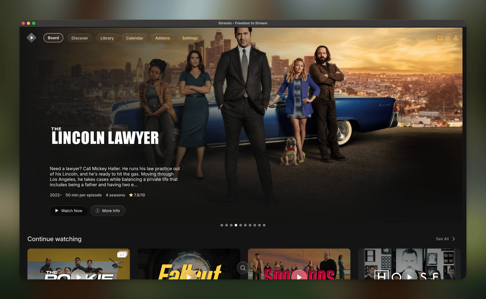
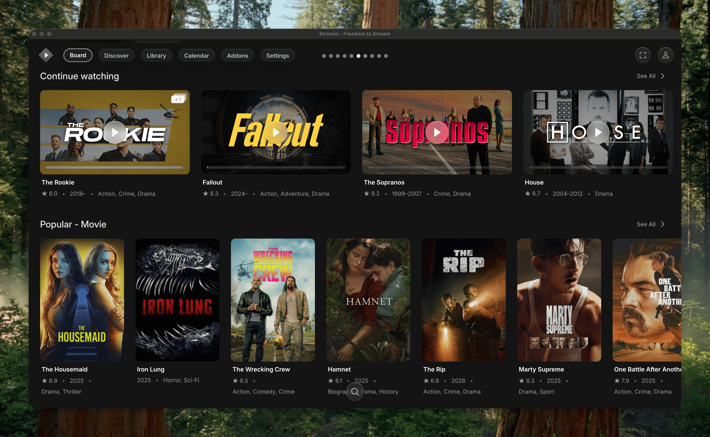
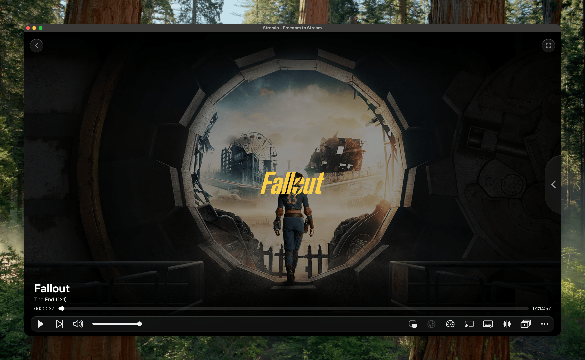

# Stremio Plus

[](https://github.com/Fxy6969/stremio-plus/stargazers)
[](https://github.com/Fxy6969/stremio-plus/releases/latest)
[](https://github.com/Fxy6969/stremio-plus/releases/latest)
[](https://discord.gg/jRBkd47x9E)
[](https://www.reddit.com/r/StremioMods/)


**Stremio Plus** is a feature-rich Electron desktop client for Stremio.  
It wraps [Stremio Web](https://web.stremio.com/) with a full plugin and theme system, Discord Rich Presence, external player routing, and more — all from a native desktop app.

> Forked from [stremio-enhanced-community](https://github.com/REVENGE977/stremio-enhanced-community) by REVENGE977. **Not affiliated with Stremio.**

---

## ✨ Features

### 🎨 Themes

Swap out Stremio's entire look with `.theme.css` files. Themes use a userscript-style header block to declare their name, version, author, and any plugins they depend on. When you apply a theme that requires a plugin you haven't installed yet, Stremio Plus will prompt you to install it first.

- Drop a `.theme.css` into your themes folder and it shows up in settings instantly
- One click to apply or revert to default
- Themes can declare `@require` dependencies on plugins
- Community-submitted themes are available through the Marketplace

### 🔌 Plugins

Extend Stremio with JavaScript plugins (`.plugin.js` files). Each plugin runs in its own isolated scope and communicates with the app through the `StremioEnhancedAPI`. Plugins are loaded in dependency order — if plugin B requires plugin A, A is always initialized first.

- Toggle plugins on/off from settings without restarting
- Plugins can register their own settings panel with toggles, inputs, selects, and more
- Per-plugin crash tracking and cold-start timing shown in the settings UI
- Plugins declare `@permission` tags for transparency about what they access
- See the [Plugin API wiki](docs/plugin-api.md) for the full developer reference

### 🛍️ Community Marketplace

Browse and install community-submitted themes and plugins directly from inside the app — no manual file management needed.


- One-click install from the registry
- Update notifications shown per-item when a new version is available
- Registry-unverified updates are flagged with a warning before applying
- Install from any direct URL with `stremio-plus://install?url=...`

### 🔧 Built-in Enhancements

| Feature | Description |
|---|---|
| **Discord Rich Presence** | Shows what you're watching on Discord with title, episode, and progress — toggleable from settings |
| **External Player** | Route streams to VLC or MPV instead of the built-in player, with configurable GLSL upscale shaders and extra MPV flags |
| **`stremio://` protocol** | Install addons directly from links without copy-pasting manifest URLs |
| **Embedded subtitle fix** | Manually injects embedded subtitles when the native Stremio Web implementation fails to load them |
| **Audio track fallback** | Adds audio track selection when the native implementation doesn't surface the available tracks |
| **ANGLE renderer picker** | Choose between DirectX 11/9, OpenGL, Vulkan, or Software rendering on Windows and Linux |
| **Window transparency** | Enables transparent-background themes by running Electron in transparent window mode |
| **Auto-updater** | Checks for new Stremio Plus releases on startup and downloads/installs updates automatically |

---

## 📷 Gallery

### Modern Glass Theme

| Main Page | Titles |
|---|---|
|  |  |

| Video Player | Settings |
|---|---|
|  |  |

---

## 📥 Downloads

https://github.com/user-attachments/assets/b01e1ef0-b266-41fd-8c6e-5e797b617d3f

Grab the latest build from [the releases tab](https://github.com/Fxy6969/stremio-plus/releases/latest).

> **macOS users:** The app is unsigned. Right-click → **Open** on first launch, or run:
> ```sh
> xattr -cr /path/to/Stremio\ Plus.app
> ```

---

## ⚙️ Build From Source

```sh
git clone https://github.com/Fxy6969/stremio-plus.git
cd stremio-plus
npm install
```

| Platform | Command |
|---|---|
| Windows | `npm run build:win` |
| Linux x64 | `npm run build:linux:x64` |
| Linux arm64 | `npm run build:linux:arm64` |
| macOS x64 | `npm run build:mac:x64` |
| macOS arm64 | `npm run build:mac:arm64` |

---

## 🎨 Installing Themes

1. Open **Settings** → scroll down to the Enhanced section → click **Open Themes Folder**
2. Drop your `.theme.css` file into that folder
3. The theme appears in settings immediately — click it to apply
4. To go back to the default look, select **Default** from the theme list

---

## 🔌 Installing Plugins

1. Open **Settings** → scroll down → click **Open Plugins Folder**
2. Drop your `.plugin.js` file into that folder
3. The plugin appears in settings — toggle it on to enable it
4. If the plugin registers a settings panel, a settings button appears on its card
5. To disable a plugin, toggle it off — a page reload is required to fully unload it (<kbd>Ctrl</kbd>+<kbd>R</kbd>)

---

## 🛠️ Plugin API

Plugins are plain JavaScript files with a userscript-style header. Inside the plugin, `StremioEnhancedAPI` is available globally:

```js
// ==Plugin==
// @name        My Plugin
// @version     1.0.0
// @author      You
// @description Does something cool
// @updateUrl   https://raw.githubusercontent.com/you/repo/main/myplugin.plugin.js
// ==/Plugin==

StremioEnhancedAPI.registerSettings([
    { key: 'enabled', type: 'toggle', label: 'Enable feature', defaultValue: true }
]);

StremioEnhancedAPI.getSetting('enabled').then(val => {
    if (val !== false) {
        StremioEnhancedAPI.logger.info('Plugin started');
        // your code here
    }
});
```

See the [Plugin API wiki](docs/plugin-api.md) for the full reference — manifest fields, all API methods, setting types, dependency declarations, and complete examples.

See the [examples/](./examples) folder for sample themes and plugins.

---

## 🧪 Known Issues

- **Blu-ray PGS subtitles** don't load due to browser limitations — use VLC or MPV for those streams
- **macOS** requires bypassing Gatekeeper on first launch (see [Downloads](#-downloads))
- Disabling a plugin requires a page reload to fully take effect

---

## 🌐 Community

Got questions, ideas, or want to share your plugins and themes?

- **Reddit:** [r/StremioMods](https://www.reddit.com/r/StremioMods/)
- **Discord:** [Join the server](https://discord.gg/jRBkd47x9E)

---

## 🤝 Contributing

1. Fork the repo
2. Create a feature branch: `git checkout -b feature/my-feature`
3. Commit and push your changes
4. Open a pull request

See [CONTRIBUTING.md](.github/CONTRIBUTING.md) for full guidelines.

---

## ⚠️ Disclaimer

Not officially affiliated with Stremio.  
Forked from [stremio-enhanced-community](https://github.com/REVENGE977/stremio-enhanced-community) by REVENGE977, licensed under MIT.  
This project is also licensed under the [MIT License](./LICENSE.md).

---

**Made with ❤️ by [Fxy6969](https://github.com/Fxy6969)**
