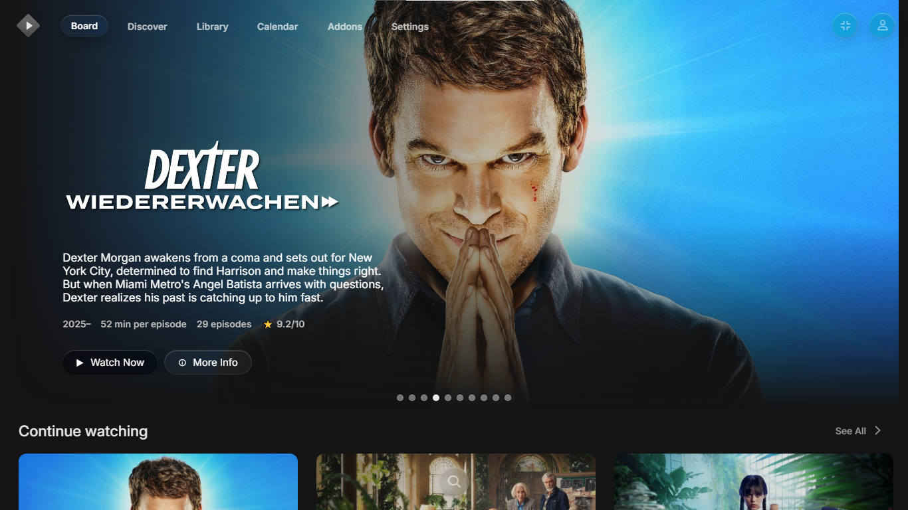
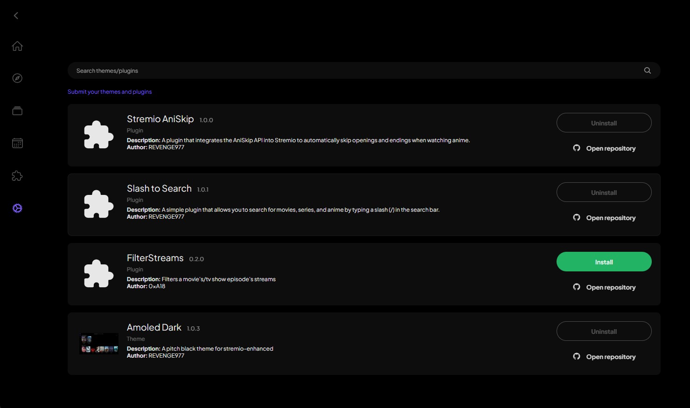
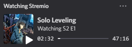
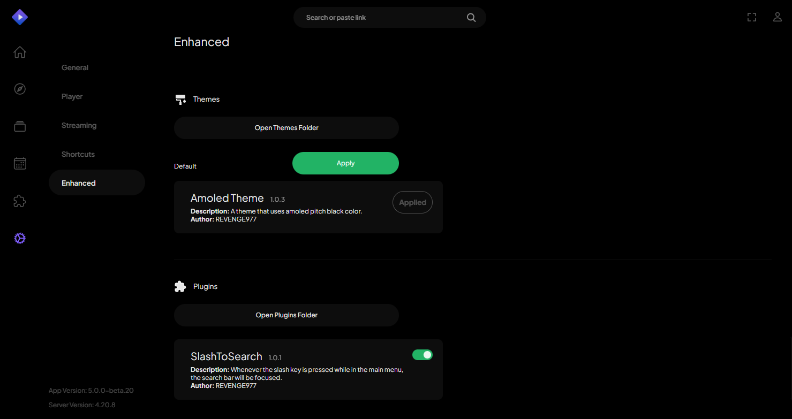
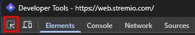

# Stremio Plus


[](https://github.com/Fxy6969/stremio-plus/stargazers)
[](https://github.com/Fxy6969/stremio-plus/releases/latest)
[](https://github.com/Fxy6969/stremio-plus/releases/latest)
[](https://discord.gg/jRBkd47x9E)
[](https://www.reddit.com/r/StremioMods/)

**Stremio Plus** is a feature-rich Electron desktop client for Stremio.  
It wraps [Stremio Web](https://web.stremio.com/) with plugin and theme support, Discord Rich Presence, external player routing, and more.

> Forked from [stremio-enhanced-community](https://github.com/REVENGE977/stremio-enhanced-community) by REVENGE977. **Not affiliated with Stremio.**

---

## ✨ Features

### 🎨 Themes & Plugins
- **CSS Themes** – Swap out Stremio's look entirely with `.theme.css` files
- **JavaScript Plugins** – Inject new features and behaviours with `.plugin.js` files
- **Plugin Settings UI** – Plugins can register their own settings panel for users to configure
- **Required Plugin declarations** – Themes can declare plugins they depend on; the app will prompt the user to install them first
- **Community Marketplace** – Browse and install community-submitted themes and plugins directly from inside the app



### 🔧 Enhancements
| Feature | Description |
|---|---|
| **Discord Rich Presence** | Shows what you're watching on Discord — toggleable from settings |
| **External Player** | Route streams to VLC or MPV instead of the built-in player |
| **`stremio://` protocol** | Install addons directly from links without copy-pasting URLs |
| **Embedded subtitle fix** | Injects embedded subs manually when the native implementation fails |
| **Audio track fallback** | Adds audio tracks when the native Stremio Web implementation fails |
| **ANGLE renderer picker** | Choose DirectX 11/9, OpenGL, Vulkan, or Software on Windows/Linux |
| **Window transparency** | Enables transparent-background themes via Electron's transparent window flag |
| **Auto-updater** | Checks for new releases and downloads/installs updates automatically |



---

## 📷 Gallery

| Settings | Dev Tools |
|---|---|
|  |  |

---

## 📥 Downloads

Grab the latest build from [the releases tab](https://github.com/Fxy6969/stremio-plus/releases/latest).

> **macOS users:** The app is unsigned. Right-click → **Open** on first launch, or run:
> ```sh
> xattr -cr /path/to/Stremio\ Plus.app
> ```

---

## ⚙️ Build From Source

```sh
git clone https://github.com/Fxy6969/stremio-plus.git
cd stremio-plus
npm install
```

| Platform | Command |
|---|---|
| Windows | `npm run build:win` |
| Linux x64 | `npm run build:linux:x64` |
| Linux arm64 | `npm run build:linux:arm64` |
| macOS x64 | `npm run build:mac:x64` |
| macOS arm64 | `npm run build:mac:arm64` |

---

## 🎨 Installing Themes

1. Settings → scroll down → **Open Themes Folder**
2. Drop your `.theme.css` file in
3. Restart Stremio Plus
4. The theme appears in settings — click to apply

---

## 🔌 Installing Plugins

1. Settings → scroll down → **Open Plugins Folder**
2. Drop your `.plugin.js` file in
3. Restart or reload with <kbd>Ctrl</kbd>+<kbd>R</kbd>
4. The plugin appears in settings — toggle to enable

---

## 🛠️ Plugin API

Plugins have access to `window.StremioEnhancedAPI`:

| Method | Description |
|---|---|
| `registerSettings(schema)` | Register a settings UI panel for your plugin |
| `getSetting(key)` | Get a saved setting value |
| `saveSetting(key, value)` | Save a setting value |
| `onSettingsSaved(cb)` | Listen for when the user saves settings |
| `showAlert(options)` | Show a native Electron alert dialog |
| `showPrompt(options)` | Show a prompt dialog for user input |
| `logger` | Winston logger (logs appear in the app log file) |

See the [examples/](./examples) folder for sample themes and plugins.

---

## 🧪 Known Issues

- **Blu-ray PGS subtitles** don't load due to browser limitations — use VLC or MPV for those streams
- **macOS** requires bypassing Gatekeeper (see [Downloads](#-downloads))

---

## 🌐 Community

Got questions, ideas, or want to share your plugins and themes?

- **Reddit:** [r/StremioMods](https://www.reddit.com/r/StremioMods/)
- **Discord:** [Join the server](https://discord.gg/jRBkd47x9E)

---

## 🤝 Contributing

1. Fork the repo
2. Create a feature branch: `git checkout -b feature/my-feature`
3. Commit and push your changes
4. Open a pull request

See [CONTRIBUTING.md](.github/CONTRIBUTING.md) for full guidelines.

---

## ⚠️ Disclaimer

Not officially affiliated with Stremio.  
Forked from [stremio-enhanced-community](https://github.com/REVENGE977/stremio-enhanced-community) by REVENGE977, licensed under MIT.  
This project is also licensed under the [MIT License](./LICENSE.md).

---

**Made with ❤️ by [Fxy6969](https://github.com/Fxy6969)**
